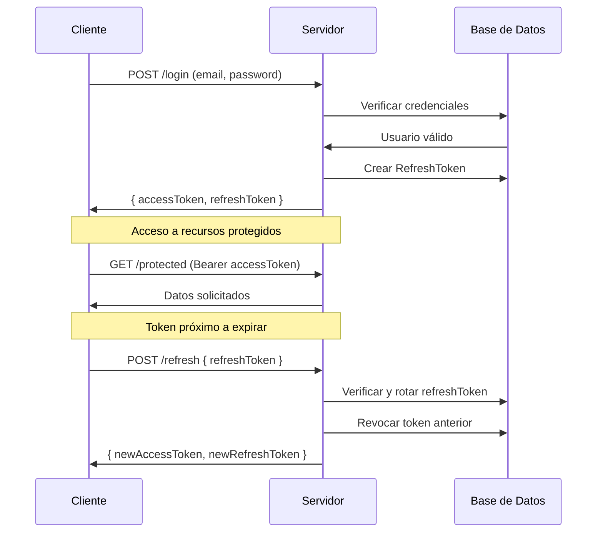

# Guía de Refresh Tokens Reforzados - SuperGains

## 📋 Introducción

Este documento describe la implementación del sistema de autenticación reforzada con refresh tokens en SuperGains, cumpliendo con las mejores prácticas de seguridad OAuth 2.0 y RFC 6749.

---

## 🔐 Arquitectura del Sistema

### **Componentes Implementados:**

1. **Modelo RefreshToken** - Almacenamiento seguro en base de datos
2. **Rotación de Tokens** - Seguridad mejorada mediante rotación automática
3. **Gestión de Sesiones** - Control granular de sesiones activas
4. **Revocación Efectiva** - Sistema de blacklist y revocación por familia
5. **Limpieza Automática** - TTL y limpieza de tokens expirados

### **Flujo de Autenticación:**



---

## 🛠️ Configuración

### **Variables de Entorno:**

```bash
# JWT Configuration
JWT_SECRET=your_jwt_secret_here
JWT_EXPIRES_IN=1h                    # Access tokens: 1 hora
JWT_REFRESH_EXPIRES_IN=7d            # Refresh tokens: 7 días (solo referencia)
REFRESH_TOKEN_EXPIRES_DAYS=30        # Refresh tokens: 30 días en DB
```

### **Configuración Recomendada:**

- **Access Tokens:** 15 minutos - 1 hora máximo
- **Refresh Tokens:** 7-30 días en base de datos
- **Rotación:** Cada uso del refresh token
- **Límite de uso:** 100 usos por refresh token

---

## 📊 Estructura del RefreshToken

### **Campos Principales:**

```javascript
{
    tokenHash: "sha256_hash",           // Hash del token real
    user: ObjectId,                      // Referencia al usuario
    tokenFamily: "uuid",                // Familia de tokens
    parentToken: ObjectId,              // Token padre (rotación)
    childTokens: [ObjectId],            // Tokens hijos
    isRevoked: Boolean,                 // Estado de revocación
    revokedReason: String,              // Razón de revocación
    deviceInfo: {
        userAgent: String,
        ipAddress: String,
        deviceType: String
    },
    expiresAt: Date,                    // Fecha de expiración
    lastUsedAt: Date,                   // Último uso
    usageCount: Number,                 // Contador de usos
    maxUsage: Number                    // Límite máximo
}
```

---

## 🔄 API Endpoints

### **1. Autenticación**

#### **POST /api/users/login**
```json
{
    "email": "usuario@ejemplo.com",
    "password": "contraseña123"
}
```

**Respuesta:**
```json
{
    "success": true,
    "message": "Inicio de sesión exitoso",
    "data": {
        "user": { ... },
        "tokens": {
            "accessToken": "jwt_token",
            "refreshToken": "refresh_token_value",
            "expiresIn": "1h"
        }
    }
}
```

#### **POST /api/users/refresh**
```json
{
    "refreshToken": "refresh_token_value"
}
```

**Respuesta:**
```json
{
    "success": true,
    "message": "Token refrescado exitosamente",
    "data": {
        "accessToken": "new_jwt_token",
        "refreshToken": "new_refresh_token_value",
        "expiresIn": "1h"
    }
}
```

#### **POST /api/users/logout**
```json
{
    "refreshToken": "refresh_token_value"
}
```

### **2. Gestión de Sesiones**

#### **GET /api/users/sessions**
**Headers:** `Authorization: Bearer <accessToken>`

**Respuesta:**
```json
{
    "success": true,
    "message": "Sesiones activas obtenidas exitosamente",
    "data": {
        "sessions": [
            {
                "id": "session_id",
                "deviceInfo": {
                    "userAgent": "Mozilla/5.0...",
                    "ipAddress": "192.168.1.1",
                    "deviceType": "desktop"
                },
                "createdAt": "2025-01-01T10:00:00Z",
                "lastUsedAt": "2025-01-01T15:30:00Z",
                "expiresAt": "2025-01-07T10:00:00Z",
                "usageCount": 5
            }
        ],
        "count": 1
    }
}
```

#### **DELETE /api/users/sessions/:sessionId**
Revoca una sesión específica.

#### **DELETE /api/users/sessions**
```json
{
    "keepCurrent": true
}
```
Revoca todas las sesiones excepto la actual.

---

## 🚨 Características de Seguridad

### **Rotación de Tokens**
- Cada vez que se usa un refresh token, se genera uno nuevo
- El token anterior se revoca después de 5 segundos (tiempo de gracia)
- Prevención de reutilización de tokens

### **Detección de Abuso**
- Límite de usos por refresh token (100 por defecto)
- Detección de múltiples tokens de la misma familia
- Revocación automática de toda la familia en caso de abuso

### **Información del Dispositivo**
- Tracking de User-Agent, IP, y tipo de dispositivo
- Posibilidad de revocar sesiones por dispositivo
- Detección de actividad sospechosa

### **Revocación Efectiva**
- Tokens revocados marcados en base de datos
- Revocación por familia completa
- Limpieza automática de tokens expirados

---

## 🔧 Mantenimiento

### **Limpieza Automática**

El sistema incluye limpieza automática mediante TTL de MongoDB y script manual:

```bash
# Limpieza manual
node scripts/cleanup-expired-tokens.js
```

### **Monitoreo Recomendado**

1. **Métricas a monitorear:**
   - Número de tokens activos por usuario
   - Frecuencia de rotación de tokens
   - Intentos de acceso con tokens revocados
   - Tiempo de respuesta del endpoint /refresh

2. **Alertas recomendadas:**
   - Uso excesivo de refresh tokens (>50 en 1 hora)
   - Múltiples fallos de verificación consecutivos
   - Tokens que exceden el límite de usos

### **Backup y Recuperación**

**Importante:** Los refresh tokens están hasheados, por lo que:
- No se pueden restaurar desde backup
- Los usuarios deberán hacer login nuevamente
- Mantener backup de la clave de cifrado JWT es crítico

---

## ⚠️ Consideraciones de Seguridad

### **Almacenamiento**
- ✅ Tokens hasheados con SHA-256
- ✅ Información de dispositivo tracking
- ✅ Revocación efectiva
- ✅ Expiración automática

### **Transmisión**
- ✅ Solo HTTPS en producción
- ✅ Headers de seguridad apropiados
- ✅ No almacenar tokens en localStorage (usar httpOnly cookies en el futuro)

### **Rotación**
- ✅ Rotación automática en cada uso
- ✅ Tokens anteriores revocados
- ✅ Prevención de reutilización

### **Auditoría**
- ✅ Logs de creación/revocación
- ✅ Tracking de uso por dispositivo
- ✅ Detección de patrones anómalos

---

## 🧪 Testing

### **Casos de Prueba Recomendados:**

1. **Flujo básico:**
   - Login → Obtener tokens
   - Usar access token
   - Refresh token
   - Logout

2. **Seguridad:**
   - Token expirado
   - Token revocado
   - Múltiples dispositivos
   - Límite de usos

3. **Edge cases:**
   - Rotación simultánea
   - Limpieza automática
   - Usuario inactivo

### **Scripts de Testing:**

```bash
# Test básico de autenticación
node scripts/test-auth-flow.js

# Test de refresh tokens
node scripts/test-refresh-tokens.js
```

---

## 🔄 Migración desde Sistema Anterior

### **Compatibilidad**
El nuevo sistema es backward compatible durante el período de transición:

1. **Tokens existentes:** Siguen funcionando hasta expirar
2. **Nuevos logins:** Usarán el nuevo sistema
3. **Gradual:** No requiere migración inmediata

### **Monitorización Post-Migración**

- Verificar logs de errores relacionados con tokens
- Monitorear métricas de performance del endpoint /refresh
- Asegurar que la limpieza automática funciona correctamente

---

## 📚 Referencias

- [RFC 6749 - The OAuth 2.0 Authorization Framework](https://tools.ietf.org/html/rfc6749)
- [RFC 7519 - JSON Web Token (JWT)](https://tools.ietf.org/html/rfc7519)
- [OWASP Authentication Cheat Sheet](https://cheatsheetseries.owasp.org/cheatsheets/Authentication_Cheat_Sheet.html)
- [NIST Cybersecurity Framework](https://www.nist.gov/cyberframework)

---

**Última actualización:** Octubre 2025  
**Responsable:** Equipo de Seguridad SuperGains
